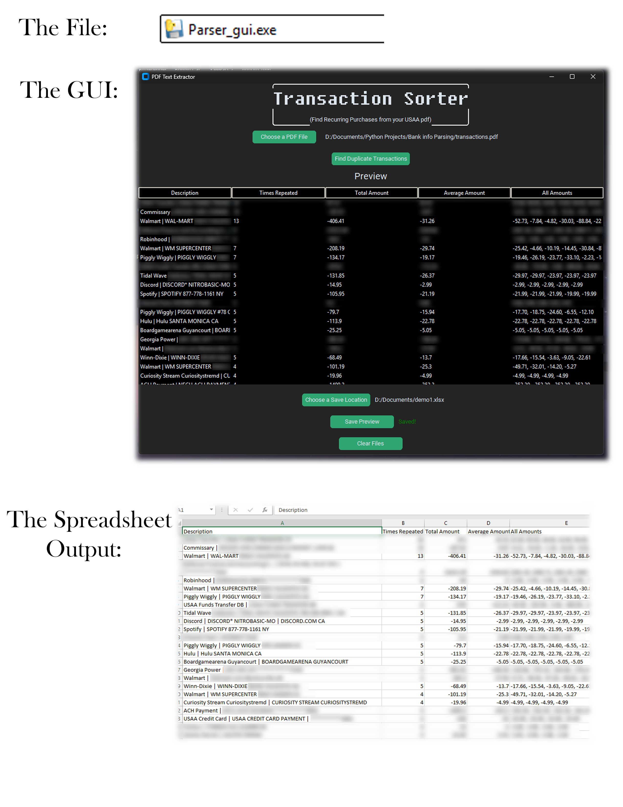

# Transaction Sorter

A Python tool that parses USAA bank statement PDFs, identifies recurring transactions, and exports the results to Excel.

## Generating the PDF

This tool works with USAA's checking or savings account transaction pages. To get a usable PDF:

1. Open the account you want to analyze
2. Scroll to the bottom and click **Load More Transactions** until you've loaded as far back as you want
3. Scroll back to the top and click the **Print** link (between **View Statements** and **Export**)
4. Save the resulting page as PDF from your browser's print dialog

## What it does
- Pulls every transaction from a USAA PDF
- Groups duplicates and calculates count, total, and average
- Previews results in a styled GUI before saving
- Exports a clean Excel report

## Built with
Python 3, pdfplumber, openpyxl, customtkinter, regex. Packaged with pyinstaller.

## Usage
Run `Transaction_Sorter.exe`, choose a PDF, click **Find Duplicate Transactions**, pick a save location.

## Limitations
USAA only, checking/savings only. Credit card and investment statements have not been tested.
